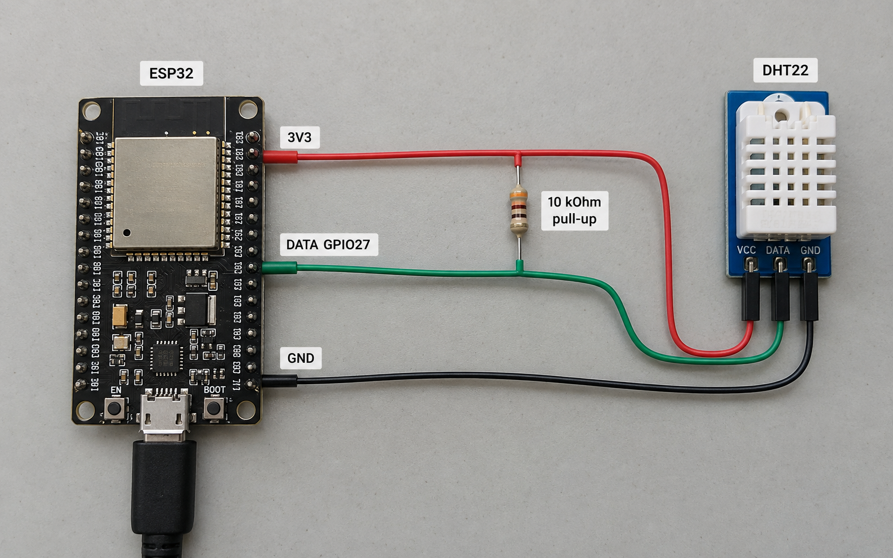
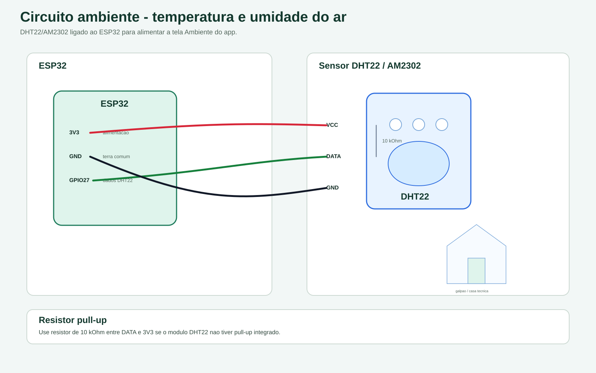

# Circuito ambiente

Circuito para temperatura e umidade do ar com ESP32 e DHT22/AM2302.

## Imagem realista

## Esquema tecnico

## Pinos usados

| Funcao | GPIO |
| --- | --- |
| DHT22 dados | GPIO27 |
| Alimentacao | 3V3 |
| Terra | GND |

Use resistor de 10 kOhm entre DATA e 3V3 se o modulo DHT22 nao tiver pull-up integrado.

