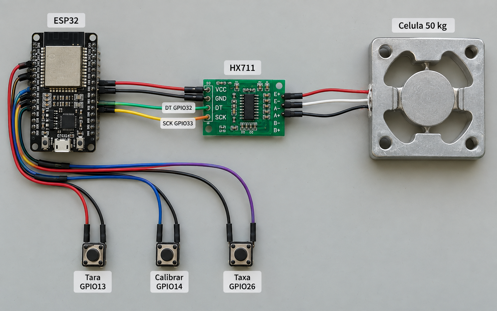
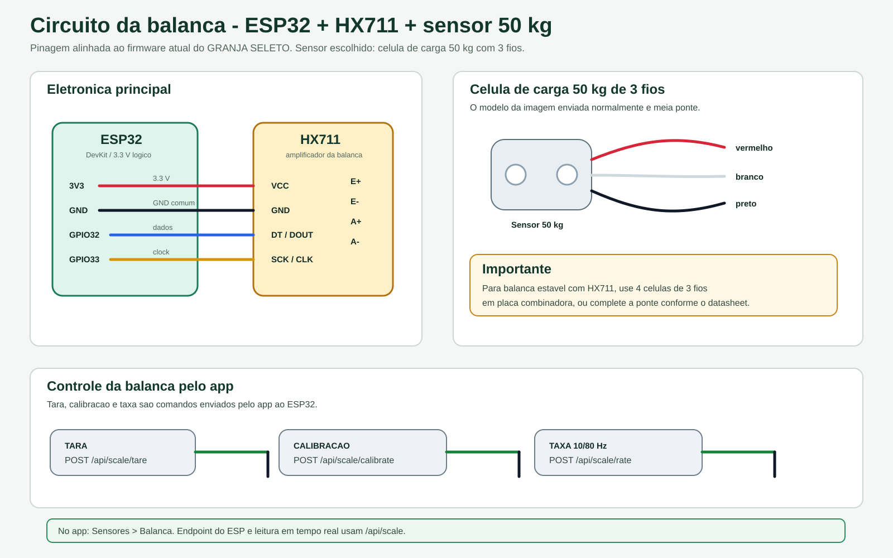
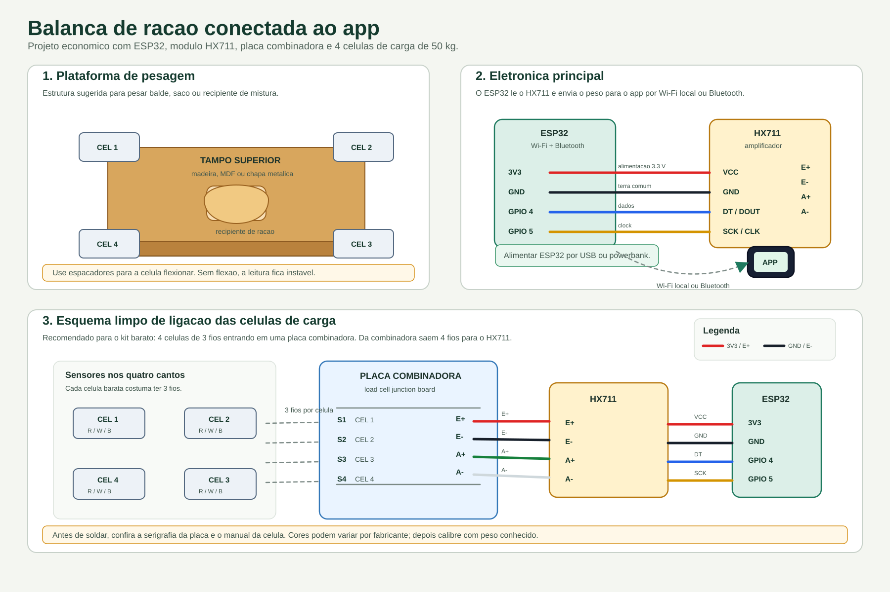

# Circuito da balanca

Circuito para balanca de racao/insumos com ESP32, HX711, celula de carga 50 kg e botoes fisicos.

## Imagem realista

## Esquema tecnico

## Plataforma com quatro celulas

## Pinos usados

| Funcao | GPIO |
| --- | --- |
| HX711 DT/DOUT | GPIO32 |
| HX711 SCK/CLK | GPIO33 |
| Botao tara | GPIO13 |
| Botao calibracao | GPIO14 |
| Botao taxa | GPIO26 |

Observacao: sensores 50 kg com 3 fios normalmente sao meia ponte. Para leitura estavel no HX711, o mais comum e usar 4 celulas de 3 fios em placa combinadora, ou completar a ponte conforme o modulo/datasheet.

