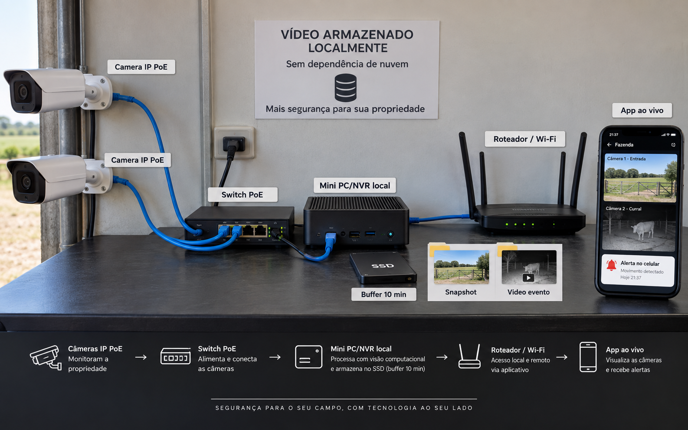
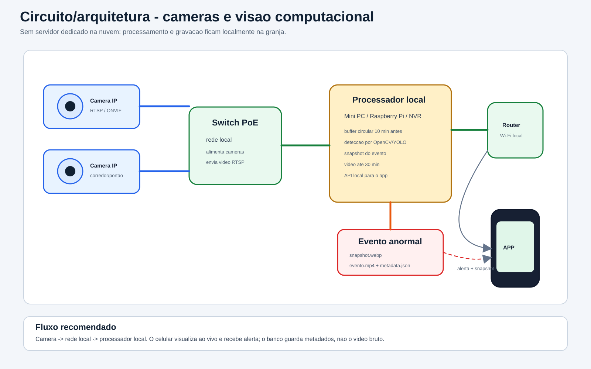

# Circuito cameras e visao computacional

Arquitetura para cameras IP, visualizacao ao vivo, alertas e armazenamento local de eventos.

## Imagem realista

## Esquema tecnico

## Guia de integracao

- [integracao_camera_visao_computacional.md](integracao_camera_visao_computacional.md)

Essa integracao nao grava video no banco do app. O app recebe metadados, snapshot e links para o video salvo no processador local/NVR.

