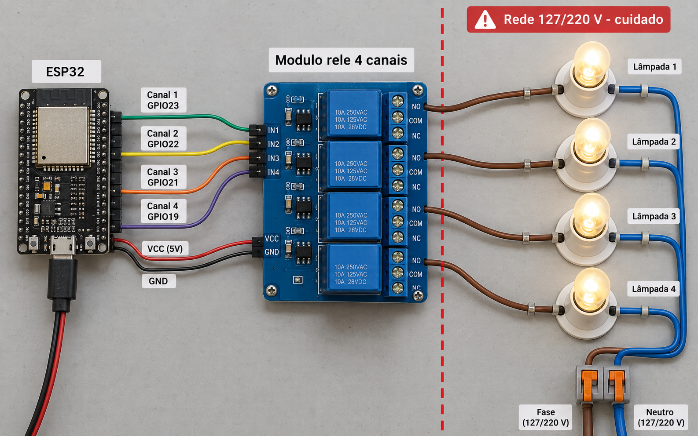
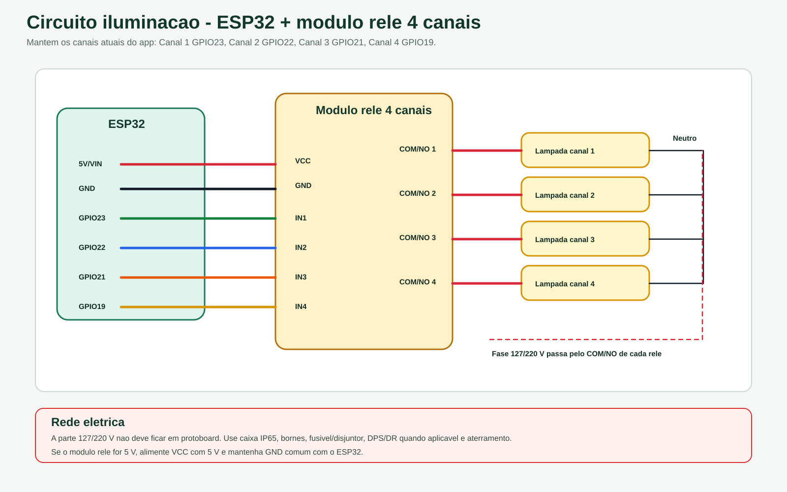

# Circuito iluminacao

Circuito para controle de lampadas com ESP32 e modulo rele de 4 canais.

## Imagem realista

## Esquema tecnico

## Pinos usados

| Canal | GPIO |
| --- | --- |
| Canal 1 | GPIO23 |
| Canal 2 | GPIO22 |
| Canal 3 | GPIO21 |
| Canal 4 | GPIO19 |

Atencao: a parte 127/220 V deve ser montada por profissional habilitado, com caixa IP65, disjuntor, DPS/DR quando aplicavel e aterramento correto.

## Variantes antigas

As imagens anteriores da iluminacao foram preservadas em [variantes](variantes/).

