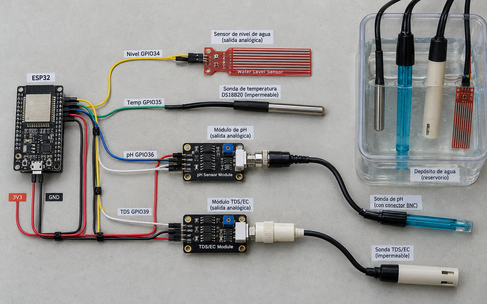
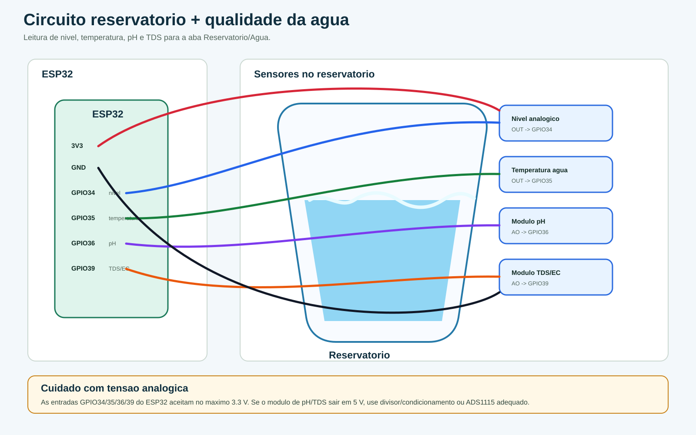

# Circuito reservatorio e agua

Circuito para nivel do reservatorio, temperatura da agua, pH e TDS/EC.

## Imagem realista

## Esquema tecnico

## Pinos usados

| Funcao | GPIO |
| --- | --- |
| Nivel da agua | GPIO34 |
| Temperatura da agua | GPIO35 |
| pH | GPIO36 |
| TDS/EC | GPIO39 |

O firmware atual le entradas analogicas diretas. Para instalacao definitiva, prefira condicionar pH/TDS/nivel para no maximo 3.3 V ou usar ADS1115 com ajuste posterior no firmware.

