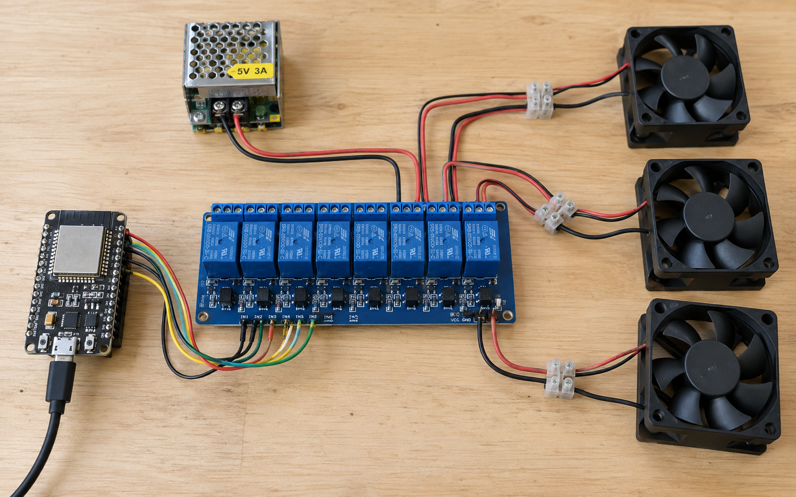
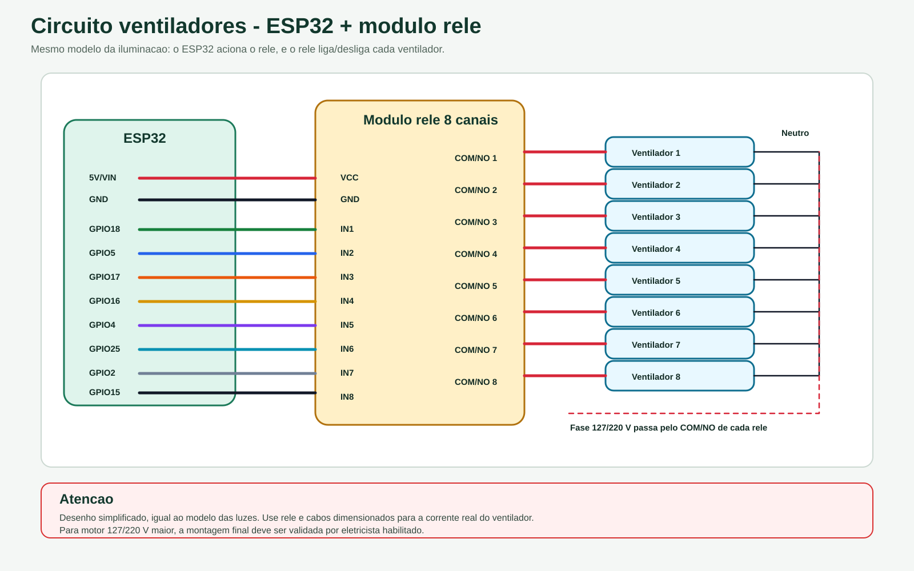

# Circuito ventiladores

Circuito simplificado para controle de ate 8 ventiladores/exaustores com ESP32 e modulo rele.

## Imagem realista gerada

## Esquema tecnico

## Fotos reais das ligacoes

Adicione as fotos reais do painel e dos ventiladores na pasta `fotos/`, mantendo estes nomes para a documentacao ficar padronizada:

| Foto | Arquivo sugerido | O que deve mostrar |
| --- | --- | --- |
| Painel aberto | `fotos/painel_ventiladores.jpg` | ESP32, modulo rele, fonte, bornes, contatores e protecoes |
| Ligacao dos reles | `fotos/reles_ventiladores.jpg` | VCC, GND, IN1-IN8 e fios de comando |
| Saida para motores | `fotos/saida_motores.jpg` | Bornes, contatores, disjuntores/termicos e cabos dos ventiladores |
| Ventilador instalado | `fotos/ventilador_instalado.jpg` | Motor/ventilador, aterramento e cabo chegando ao equipamento |

> A imagem `componentes_reais.png` mostra uma montagem realista gerada para referencia visual. Ela nao substitui fotos reais tiradas do seu painel.

## Pinos usados

| Canal ESP | Uso | GPIO padrao |
| --- | --- | --- |
| 5 | Ventilacao 1 | GPIO18 |
| 6 | Ventilacao 2 | GPIO5 |
| 7 | Ventilacao 3 | GPIO17 |
| 8 | Ventilacao 4 | GPIO16 |
| 9 | Ventilacao 5 | GPIO4 |
| 10 | Ventilacao 6 | GPIO25 |
| 11 | Ventilacao 7 | GPIO2 |
| 12 | Ventilacao 8 | GPIO15 |

## Ligacao simplificada

| Trecho | Ligacao |
| --- | --- |
| ESP32 para rele | GPIO do canal -> IN do rele correspondente |
| Alimentacao do rele | VCC 5 V, GND comum com ESP32 |
| Saida do rele | COM/NO liga a fase do ventilador correspondente |
| Retorno | Neutro comum para os ventiladores |
| Protecao | Fusivel/disjuntor, aterramento e cabos dimensionados |

Atencao: este e o desenho simples, no mesmo modelo da iluminacao. Ventiladores e exaustores sao cargas indutivas; use rele e cabos dimensionados para a corrente real do motor. A montagem em rede eletrica deve ser feita por profissional habilitado.
